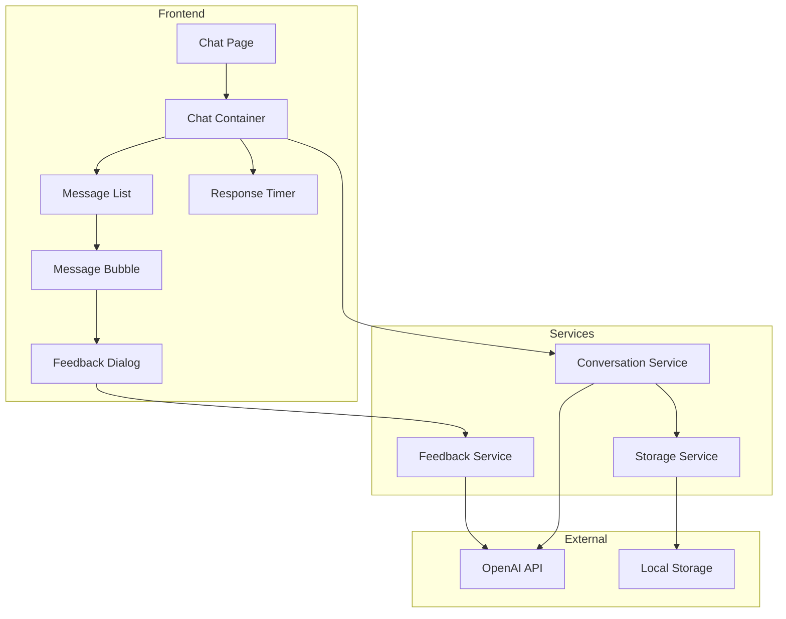
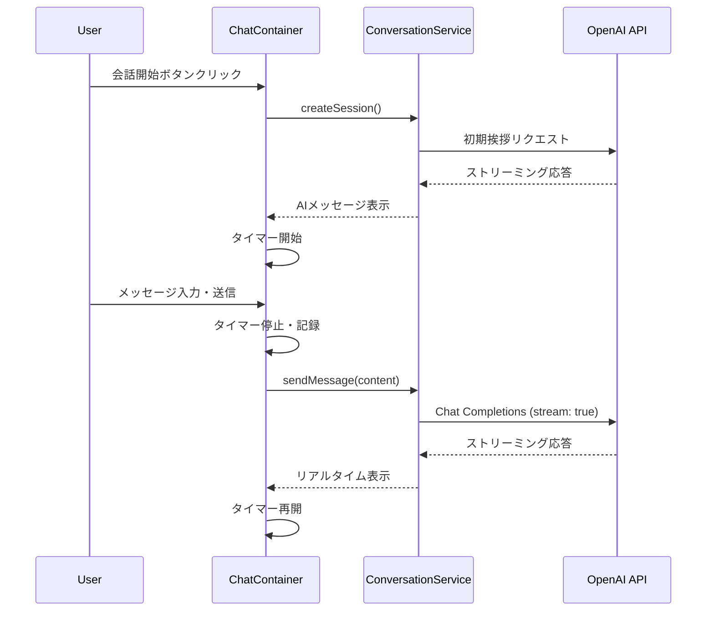
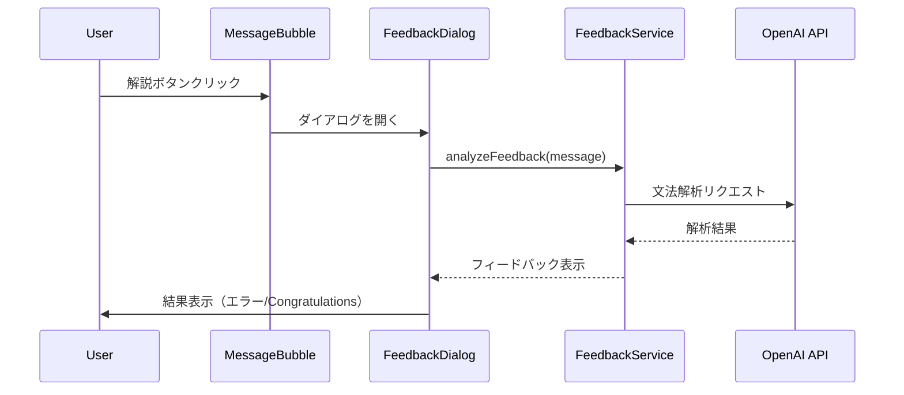
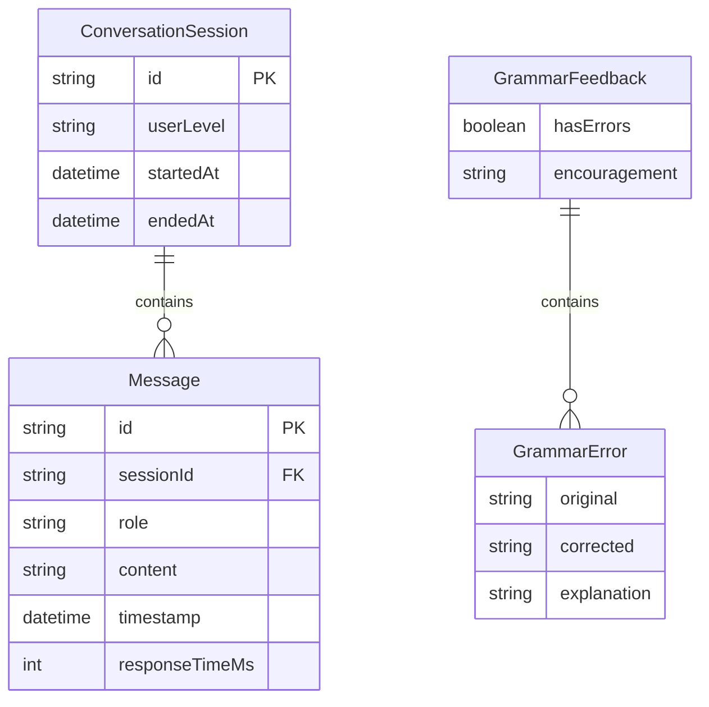

# Design Document: AI Conversation

## Overview

**Purpose**: この機能は、ユーザーがAIと対話形式で英会話練習を行うためのリアルタイムチャット機能を提供する。

**Users**: 英語スピーキング力を向上させたい学習者が、AIパートナーとの会話練習に使用する。

**Impact**: 新規機能として、英会話練習のコアエクスペリエンスを確立する。

### Goals
- ユーザーとAIのリアルタイム対話を実現
- 1秒以内の応答表示で瞬発力トレーニングをサポート
- オンデマンドの文法フィードバックを提供
- 会話履歴の保存と閲覧機能を実装

### Non-Goals
- 音声入出力機能（将来フェーズで検討）
- ユーザー認証・アカウント管理
- 複数デバイス間の同期
- 発音評価機能

## Architecture

### Architecture Pattern & Boundary Map



**Architecture Integration**:
- **Selected pattern**: Hybrid（機能別 + 共通コンポーネント）— スケーラビリティと初期シンプルさのバランス
- **Domain boundaries**: UI Components / Services / External APIs の3層分離
- **New components rationale**: チャット機能に特化したコンポーネント群を新規作成

### Technology Stack

| Layer | Choice / Version | Role in Feature | Notes |
|-------|------------------|-----------------|-------|
| Frontend | React 19 + TypeScript | チャットUI、状態管理 | Strict mode有効 |
| Styling | TailwindCSS 3.x | UIスタイリング | ユーティリティファースト |
| State | useState + useContext | 会話状態管理 | 将来Zustand検討 |
| API Client | Fetch API | OpenAI通信 | ストリーミング対応 |
| AI Backend | OpenAI Chat Completions API | AI応答生成 | gpt-4o使用 |
| Storage | LocalStorage | 会話履歴保存 | 5MB制限 |

## System Flows

### 会話フロー



### フィードバックフロー



## Requirements Traceability

| Requirement | Summary | Components | Interfaces | Flows |
|-------------|---------|------------|------------|-------|
| 1.1, 1.2, 1.3 | 会話開始 | ChatContainer, ConversationService | ConversationService | 会話フロー |
| 2.1, 2.2, 2.3, 2.4 | メッセージ送信 | ChatContainer, MessageList | ConversationService | 会話フロー |
| 3.1, 3.2, 3.3, 3.4 | AI応答生成 | ConversationService | OpenAI API | 会話フロー |
| 4.1, 4.2, 4.3, 4.4 | 瞬発力トレーニング | ResponseTimer, ChatContainer | TimerState | 会話フロー |
| 5.1, 5.2, 5.3, 5.4, 5.5, 5.6 | フィードバック | FeedbackDialog, FeedbackService | FeedbackService | フィードバックフロー |
| 6.1, 6.2, 6.3, 6.4 | 会話履歴管理 | HistoryPage, StorageService | StorageService | - |
| 7.1, 7.2, 7.3 | 会話終了 | ChatContainer, SessionSummary | ConversationService | - |

## Components and Interfaces

| Component | Domain/Layer | Intent | Req Coverage | Key Dependencies | Contracts |
|-----------|--------------|--------|--------------|------------------|-----------|
| ChatContainer | UI | 会話画面のメインコンテナ | 1, 2, 4, 7 | ConversationService (P0), ResponseTimer (P1) | State |
| MessageList | UI | メッセージ一覧表示 | 2.1 | MessageBubble (P1) | - |
| MessageBubble | UI | 個別メッセージ表示 | 2.1, 5.1 | FeedbackDialog (P2) | - |
| FeedbackDialog | UI | 文法フィードバックダイアログ | 5 | FeedbackService (P0) | - |
| ResponseTimer | UI | 瞬発力タイマー表示 | 4 | - | State |
| ConversationService | Service | 会話ロジック・API通信 | 1, 2, 3, 7 | OpenAI API (P0), StorageService (P1) | Service, API |
| FeedbackService | Service | 文法解析ロジック | 5 | OpenAI API (P0) | Service |
| StorageService | Service | 会話履歴永続化 | 6 | LocalStorage (P0) | Service |

### Services

#### ConversationService

| Field | Detail |
|-------|--------|
| Intent | 会話セッションの作成、メッセージ送受信、AI応答の取得を担当 |
| Requirements | 1.1, 1.2, 1.3, 2.1, 2.2, 2.3, 2.4, 3.1, 3.2, 3.3, 3.4, 7.1, 7.2, 7.3 |

**Responsibilities & Constraints**
- 会話セッションのライフサイクル管理
- OpenAI APIへのリクエスト・ストリーミング処理
- ユーザーレベルに応じたプロンプト調整
- エラー時のリトライ・フォールバック

**Dependencies**
- Outbound: OpenAI API — AI応答生成 (P0)
- Outbound: StorageService — 会話履歴保存 (P1)

**Contracts**: Service [x] / API [x] / Event [ ] / Batch [ ] / State [ ]

##### Service Interface
```typescript
interface Message {
  id: string;
  role: 'user' | 'assistant';
  content: string;
  timestamp: Date;
  responseTimeMs?: number;
}

interface ConversationSession {
  id: string;
  messages: Message[];
  startedAt: Date;
  endedAt?: Date;
  userLevel: 'beginner' | 'intermediate' | 'advanced';
}

interface SessionSummary {
  messageCount: number;
  averageResponseTimeMs: number;
  fastResponseCount: number;
}

interface ConversationServiceInterface {
  createSession(userLevel: string): Promise<ConversationSession>;
  sendMessage(sessionId: string, content: string): AsyncGenerator<string>;
  endSession(sessionId: string): Promise<SessionSummary>;
  getSession(sessionId: string): ConversationSession | null;
}
```
- Preconditions: 有効なセッションIDが必要（sendMessage, endSession）
- Postconditions: メッセージは会話履歴に追加される
- Invariants: セッション内のメッセージは時系列順

##### API Contract
| Method | Endpoint | Request | Response | Errors |
|--------|----------|---------|----------|--------|
| POST | OpenAI /v1/chat/completions | ChatRequest | Stream<ChatChunk> | 401, 429, 500 |

#### FeedbackService

| Field | Detail |
|-------|--------|
| Intent | ユーザーメッセージの文法解析とフィードバック生成 |
| Requirements | 5.1, 5.2, 5.3, 5.4, 5.5, 5.6 |

**Responsibilities & Constraints**
- ユーザー主導（解説ボタンクリック時のみ）でフィードバック生成
- 文法エラー検出と正しい表現の提案
- あたたかみのあるトーンでのフィードバック

**Dependencies**
- Outbound: OpenAI API — 文法解析 (P0)

**Contracts**: Service [x] / API [ ] / Event [ ] / Batch [ ] / State [ ]

##### Service Interface
```typescript
interface GrammarFeedback {
  hasErrors: boolean;
  errors: GrammarError[];
  suggestions: string[];
  encouragement: string;
}

interface GrammarError {
  original: string;
  corrected: string;
  explanation: string;
}

interface FeedbackServiceInterface {
  analyzeFeedback(message: string, context: Message[]): Promise<GrammarFeedback>;
}
```
- Preconditions: 解析対象のメッセージが空でないこと
- Postconditions: フィードバックオブジェクトを返却
- Invariants: 正しい表現の場合はhasErrors=falseで励ましメッセージ

#### StorageService

| Field | Detail |
|-------|--------|
| Intent | 会話履歴のLocalStorage永続化と取得 |
| Requirements | 6.1, 6.2, 6.3, 6.4 |

**Responsibilities & Constraints**
- セッション自動保存
- 履歴一覧の取得
- セッション削除

**Dependencies**
- External: LocalStorage — データ永続化 (P0)

**Contracts**: Service [x] / API [ ] / Event [ ] / Batch [ ] / State [ ]

##### Service Interface
```typescript
interface StorageServiceInterface {
  saveSession(session: ConversationSession): void;
  getSessions(): ConversationSession[];
  getSession(id: string): ConversationSession | null;
  deleteSession(id: string): boolean;
}
```
- Preconditions: LocalStorageが利用可能であること
- Postconditions: データが永続化/削除される
- Invariants: 容量制限（5MB）を超えた場合は古いセッションを削除

### UI Components

#### ChatContainer

| Field | Detail |
|-------|--------|
| Intent | 会話画面のメインコンテナ、状態管理とサービス連携 |
| Requirements | 1.1, 1.2, 1.3, 2.1, 2.2, 2.3, 2.4, 4.1, 4.2, 4.3, 4.4, 7.1, 7.2, 7.3 |

**Contracts**: Service [ ] / API [ ] / Event [ ] / Batch [ ] / State [x]

##### State Management
```typescript
interface ChatState {
  session: ConversationSession | null;
  isLoading: boolean;
  streamingContent: string;
  timerStartTime: number | null;
  currentResponseTime: number;
  error: string | null;
}

interface ChatActions {
  startSession: (userLevel: string) => Promise<void>;
  sendMessage: (content: string) => Promise<void>;
  endSession: () => Promise<void>;
}
```
- State model: React useState + useReducer
- Persistence: セッション変更時にStorageServiceへ自動保存
- Concurrency: 送信中は追加送信をブロック

**Implementation Notes**
- Integration: ConversationServiceを通じてAPIと連携
- Validation: 空メッセージの送信を防止
- Risks: ストリーミング中のコンポーネントアンマウント対応

#### ResponseTimer

| Field | Detail |
|-------|--------|
| Intent | 瞬発力トレーニング用タイマー表示 |
| Requirements | 4.1, 4.2, 4.3 |

**Contracts**: Service [ ] / API [ ] / Event [ ] / Batch [ ] / State [x]

##### State Management
```typescript
interface TimerProps {
  isActive: boolean;
  onTimeRecorded: (timeMs: number) => void;
}

interface TimerState {
  elapsedMs: number;
  isFastResponse: boolean;
}
```
- State model: requestAnimationFrameによる高精度タイマー
- Persistence: なし（リアルタイム表示のみ）
- Concurrency: タイマー重複起動防止

**Implementation Notes**
- Integration: ChatContainerからisActiveプロップで制御
- Validation: 1秒（1000ms）以内かどうかを判定
- Risks: ブラウザタブ非アクティブ時の精度低下

#### FeedbackDialog

| Field | Detail |
|-------|--------|
| Intent | 文法フィードバックをモーダルダイアログで表示 |
| Requirements | 5.1, 5.2, 5.3, 5.4, 5.5, 5.6 |

**Implementation Notes**
- Integration: FeedbackServiceを呼び出してフィードバック取得
- Validation: 解析中はローディング表示
- Risks: API遅延時のUX考慮

## Data Models

### Domain Model



### Logical Data Model

**Structure Definition**:
- ConversationSession: 会話セッションの集約ルート
- Message: セッションに属するメッセージエンティティ
- GrammarFeedback: 値オブジェクト（永続化不要）

**Consistency & Integrity**:
- セッション内メッセージは時系列順を保持
- メッセージIDはUUID v4で生成

## Error Handling

### Error Strategy
- **User Errors**: 入力バリデーションでフロントエンドで防止
- **API Errors**: リトライロジック（最大3回）とユーザーフレンドリーなエラーメッセージ
- **Network Errors**: オフライン検知とリトライ案内

### Error Categories and Responses
| Category | Error | Response |
|----------|-------|----------|
| User Error | 空メッセージ送信 | 送信ボタン無効化 |
| API Error | 401 Unauthorized | API設定確認を促す |
| API Error | 429 Rate Limit | 待機時間表示、リトライ |
| API Error | 500 Server Error | 再試行ボタン表示 |
| Network Error | オフライン | オフライン通知、ローカル保存 |

### Monitoring
- コンソールログでエラー記録
- 将来的にSentry等の導入を検討

## Testing Strategy

### Unit Tests
- ConversationService: セッション作成、メッセージ追加、終了処理
- FeedbackService: 文法解析結果のパース
- StorageService: LocalStorage操作
- ResponseTimer: タイマー精度、1秒判定

### Integration Tests
- ConversationService → OpenAI API: ストリーミング応答処理
- ChatContainer → ConversationService: 会話フロー全体
- StorageService → LocalStorage: データ永続化

### E2E/UI Tests
- 会話開始から終了までのフロー
- メッセージ送受信とリアルタイム表示
- フィードバックダイアログの開閉と表示
- 会話履歴の閲覧と削除

### Performance
- ストリーミング応答の初回表示時間（< 1秒）
- タイマー更新の滑らかさ（60fps目標）
- LocalStorage読み書き速度
